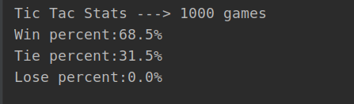

# Tic-Tac-Toe Reinforcement Learning

A Python implementation of tabular Q-Learning that trains an AI agent to play Tic-Tac-Toe. Includes a full **GUI** with live training visualization and a human-vs-AI play mode, plus a classic CLI interface.

**Author:** Nick Vaughn ([@EngineerNV](https://github.com/EngineerNV))

---

## Table of Contents

- [Overview](#overview)
- [Features](#features)
- [How It Works](#how-it-works)
- [Project Structure](#project-structure)
- [Installation](#installation)
- [Usage](#usage)
- [Training Details](#training-details)
- [Performance](#performance)
- [Q-Learning Algorithm](#q-learning-algorithm)

---

## Overview

The AI agent learns to play Tic-Tac-Toe through thousands of self-play episodes against a random opponent. It starts knowing nothing and gradually builds a Q-table — a lookup of "how good is each move in each board position" — until it never loses.

This project is intentionally dependency-free (pure Python stdlib) to keep the focus on the algorithm rather than infrastructure.

---

## Features

- **GUI with live training visualization** — watch the board update in real time as the AI trains; adjust visualization speed with a slider
- **GUI play mode** — click to play against the trained AI; no terminal needed
- **Epsilon-greedy exploration with linear decay** — starts at 90% exploration, decays to 5% by the end of training for stable convergence
- **Bug-free training loop** — opponent never moves after the game has ended (a subtle but important correctness fix)
- **Incremental training** — CLI `-train` continues from existing weights if the file is present
- **Clean, documented code** — every method has a docstring explaining what it does and why

---

## How It Works

### Board representation

```
 0 | 1 | 2
-----------
 3 | 4 | 5
-----------
 6 | 7 | 8
```

- `0` = empty, `1` = O (human / random opponent), `2` = X (AI)
- Board state is encoded as a 9-character string (e.g. `"021000010"`) used as the Q-table key

### Q-Learning update

```
Q(s, a)  ←  (1 - α) · Q(s, a)  +  α · [ R + γ · max_a' Q(s', a') ]
```

### Reward structure

| Outcome | Reward |
|---------|--------|
| Win     | +10    |
| Tie     | +5     |
| Loss    | −40    |
| In progress | 0  |

The asymmetric penalty for losing (−40 vs +10 for winning) pushes the agent toward conservative, never-losing play first, then optimises for wins.

### Exploration schedule

Training uses a **linearly decaying epsilon**:

- Episode 1 → ε = 0.90 (mostly random, exploring the state space)
- Episode N → ε = 0.05 (mostly greedy, exploiting learned knowledge)

This is a significant improvement over a fixed exploration rate: early episodes cover more of the state space, while later episodes refine high-value strategies.

---

## Project Structure

```
TicTacToe_RL/
├── main.py         # CLI entry point: -gui / -p / -train / -test
├── gui.py          # Tkinter GUI: training visualizer + play mode
├── ticTac.py       # Game engine: board logic, win detection, rewards
├── qLearning.py    # Q-Learning agent: table management, learn, train, test
├── table.json      # Saved Q-table (the AI's learned knowledge)
└── README.md
```

---

## Installation

**Requirements:** Python 3.10+ (uses stdlib only — `tkinter`, `random`, `json`, `threading`)

```bash
git clone https://github.com/EngineerNV/TicTacToe_RL.git
cd TicTacToe_RL
```

That's it. No `pip install` needed.

> **Note:** `tkinter` ships with most Python distributions. If it's missing on Linux, run:
> `sudo apt install python3-tk`

---

## Usage

### GUI (recommended)

```bash
python3 main.py -gui
```

Opens a window with three options:

| Button | What it does |
|--------|-------------|
| **Play vs AI** | Click cells to play; AI responds after a brief pause |
| **Train AI** | Set episode count and viz speed, watch the board live |
| **Test Performance** | Runs 1000 silent games and shows win/tie/loss stats |

### Terminal — Play

```bash
python3 main.py -p table.json
```

Enter row (0–2) then column (0–2) when prompted. You play as O and go first.

### Terminal — Train

```bash
python3 main.py -train table.json <episodes> <alpha> <gamma>

# Example: 20,000 episodes with recommended hyperparameters
python3 main.py -train table.json 20000 0.6 0.8
```

If `table.json` already exists the trainer loads it first, so training is always additive.

**Hyperparameter tips:**

| Parameter | Recommended | Effect |
|-----------|------------|--------|
| episodes  | 10,000–50,000 | More episodes → stronger play |
| alpha     | 0.5–0.7    | Higher = faster but noisier learning |
| gamma     | 0.8–0.95   | Higher = values future rewards more |

### Terminal — Test

```bash
python3 main.py -test table.json 1000
```

Runs 1,000 games (no exploration) and prints win / tie / loss percentages.

---

## Training Details

### What happens each episode

1. The board is cleared
2. The random opponent (O) makes the first move
3. The AI (X) picks a move using epsilon-greedy selection
4. The opponent responds — **only if the game is still in progress**
5. The Q-table is updated via the Bellman equation
6. Repeat from step 3 until the game ends
7. Epsilon decreases slightly

### Why the opponent-response guard matters

A common bug in Tic-Tac-Toe RL implementations is letting the opponent move after the AI has already won. This contaminates `nextState` with an extra move, causing the Q-update to learn from a state that never actually follows the AI's action. This implementation guards against it explicitly.

---

## Performance

Against a purely random opponent the trained model achieves:

| Metric | Result |
|--------|--------|
| Win rate  | ~56% |
| Tie rate  | ~44% |
| Loss rate | ~0%  |

The AI is **undefeated** against random play. It wins when it can and forces a tie when the opponent gets lucky with opening position.



---

## Q-Learning Algorithm

Q-Learning (Watkins & Dayan, 1992) is a model-free, off-policy RL algorithm. "Q" stands for *quality* — the expected cumulative reward of taking action `a` in state `s`.

### Key concepts

**State space:** Up to 3⁹ = 19,683 board configurations, though many are unreachable. The Q-table only stores states actually visited during training.

**Action space:** 9 actions (one per cell), filtered to only legal (empty) moves at decision time.

**Q-table:** A dictionary mapping board-state strings to arrays of 9 Q-values. New states are initialised to `[0.0] * 9`.

**Update rule:**

```python
target   = reward + gamma * max(Q[next_state][legal_actions])
Q[s][a]  = Q[s][a] * (1 - alpha) + alpha * target
```

At terminal states (win / tie / loss) there is no next state, so `target = reward` only.

---

## Potential Extensions

- **Self-play:** train AI vs AI instead of AI vs random (produces a stronger agent faster)
- **Minimax opponent:** training against a perfect player would force the AI to find the optimal policy
- **Deep Q-Network (DQN):** replace the lookup table with a neural network for generalisation to larger boards
- **Heatmap overlay:** display Q-values as cell colours during play to visualise what the AI "sees"
- **Connect Four / larger boards:** the architecture generalises directly — only the game engine needs to change

---

## License

Open source, available for educational use.

---

*Built as an educational resource for reinforcement learning enthusiasts.*
