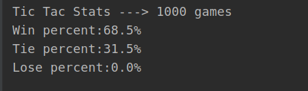

# Tic-Tac-Toe Reinforcement Learning (Q-Learning)

A Python implementation of Q-Learning algorithm to train an AI agent that plays Tic-Tac-Toe. This project demonstrates the application of reinforcement learning techniques to a classic game environment.

**Author:** Nick Vaughn ([@EngineerNV](https://github.com/EngineerNV))

---

## 📋 Table of Contents

- [Project Overview](#project-overview)
- [Objectives](#objectives)
- [Tech Stack](#tech-stack)
- [How It Works](#how-it-works)
- [Project Structure](#project-structure)
- [Installation & Setup](#installation--setup)
- [Usage](#usage)
- [Performance Metrics](#performance-metrics)
- [Q-Learning Algorithm](#q-learning-algorithm)
- [Future Improvements](#future-improvements)

---

## 🎯 Project Overview

This repository showcases a reinforcement learning implementation where an AI agent learns to play Tic-Tac-Toe through self-play against a random opponent. The project serves as an educational tutorial demonstrating how to apply Q-Learning algorithms to games with multiple states that cannot be easily cataloged with simple conditional logic.

The AI learns optimal gameplay strategies by exploring different board states and actions, gradually improving its performance through trial and error over thousands of training episodes.

---

## 🎓 Objectives

1. **Demonstrate Q-Learning Implementation**: Apply reinforcement learning theory to a practical game scenario
2. **State Space Management**: Handle complex game states using dictionary-based Q-table storage
3. **Educational Resource**: Provide a clear, understandable example of RL techniques for learning purposes
4. **Performance Optimization**: Train an AI agent that can consistently win or tie against random opponents

---

## 🛠️ Tech Stack

- **Language:** Python 3.x
- **Core Libraries:**
  - `random` - For exploration during training and random opponent moves
  - `json` - For persisting learned Q-values between sessions
  - `sys` - For command-line argument parsing
- **Algorithm:** Q-Learning (Reinforcement Learning)
- **Data Structure:** Dictionary-based Q-table for state-action value storage

**No external dependencies required** - uses only Python standard library!

---

## 🧠 How It Works

### Game Representation

The Tic-Tac-Toe board is represented as a 3x3 grid with the following conventions:
- `0` = Empty cell
- `1` = Player O (Random opponent)
- `2` = Player X (AI agent)

Board positions are indexed 0-8 in linear format:
```
 0 | 1 | 2
-----------
 3 | 4 | 5
-----------
 6 | 7 | 8
```

### Q-Learning Process

1. **State Representation**: Each unique board configuration is converted to a string key (e.g., "012000000")
2. **Action Selection**: For each state, the agent can take actions corresponding to available empty cells
3. **Exploration vs Exploitation**: During training, there's a 25% chance of making random moves (exploration) vs choosing the best known move (exploitation)
4. **Learning Updates**: After each move, Q-values are updated based on rewards and future state predictions

### Training Flow

```
For each training episode:
  1. Clear the board
  2. Random opponent makes first move
  3. While game not over:
     - AI observes current state
     - AI selects action (75% Q-learning, 25% random exploration)
     - Opponent makes random move
     - Update Q-table based on reward and next state
  4. Repeat for thousands of episodes
```

---

## 📁 Project Structure

```
TicTacToe_RL/
│
├── main.py              # Main entry point - CLI interface for training/testing/playing
├── ticTac.py            # Tic-Tac-Toe game logic and mechanics
├── qLearning.py         # Q-Learning algorithm implementation
├── table.json           # Saved Q-table (trained model weights)
├── winStatsTicTac.PNG   # Performance visualization
├── .gitignore           # Git ignore patterns
└── README.md            # This file
```

### File Descriptions

#### `main.py`
Command-line interface providing three modes:
- **Play Mode**: Human vs trained AI
- **Train Mode**: Train the AI agent
- **Test Mode**: Evaluate AI performance over multiple games

#### `ticTac.py`
Game engine containing:
- Board state management
- Win condition checking
- Move validation
- Reward calculation for reinforcement learning
- Board-to-state conversion utilities

#### `qLearning.py`
Q-Learning agent implementation:
- Q-table initialization and management
- Learning algorithm (Q-value updates)
- Action selection (exploration/exploitation)
- Model persistence (save/load Q-table)
- Training and testing loops

#### `table.json`
Serialized Q-table containing learned state-action values from training. This file stores the "knowledge" the AI has acquired about which moves are good in different board states.

---

## 🚀 Installation & Setup

### Prerequisites
- Python 3.x (tested with Python 3.12.3)

### Installation

1. **Clone the repository:**
   ```bash
   git clone https://github.com/EngineerNV/TicTacToe_RL.git
   cd TicTacToe_RL
   ```

2. **No additional dependencies needed!** The project uses only Python standard library.

---

## 💻 Usage

### Play Against the AI

Test your skills against the trained AI:
```bash
python3 main.py -p table.json
```

You play as 'O' and go first. Enter row (0-2) and column (0-2) when prompted.

**Example gameplay:**
```
Choose Row 0-2: 1
Choose Col 0-2: 1
```

### Train a New AI

Train the AI from scratch or improve existing weights:
```bash
python3 main.py -train table.json <episodes> <alpha> <gamma>
```

**Parameters:**
- `table.json`: Filename to save trained weights
- `episodes`: Number of training games (e.g., 10000)
- `alpha`: Learning rate (0-1), recommended: 0.6
- `gamma`: Discount factor (0-1), recommended: 0.8

**Example:**
```bash
python3 main.py -train table.json 10000 0.6 0.8
```

**Training Tips:**
- Start with 10,000 episodes for basic competency
- Use 50,000+ episodes for optimal performance
- Higher `gamma` (closer to 1.0) makes the AI value future rewards more
- Higher `alpha` (closer to 1.0) makes learning faster but potentially less stable

### Test AI Performance

Evaluate the trained AI over multiple games:
```bash
python3 main.py -test table.json <num_games>
```

**Example:**
```bash
python3 main.py -test table.json 100
```

**Output:**
```
Tic Tac Stats ---> 100 games
Win percent: 56.0%
Tie percent: 44.0%
Lose percent: 0.0%
```

---

## 📊 Performance Metrics

The trained AI (included `table.json`) demonstrates strong performance against random opponents:

- **Win Rate:** ~56%
- **Tie Rate:** ~44%
- **Loss Rate:** ~0%
- **Undefeated Rate:** 100% (no losses)

These metrics show that the AI has learned to:
1. Never lose against random play
2. Win more than half the time when possible
3. Force ties in situations where winning isn't achievable



---

## 🔬 Q-Learning Algorithm

### Algorithm Overview

Q-Learning is a model-free reinforcement learning algorithm that learns the value of actions in different states. The "Q" stands for quality, representing how good an action is in a given state.

### Core Formula

```
Q(s, a) = Q(s, a) × (1 - α) + α × [R(s', a) + γ × max(Q(s', a'))]
```

**Where:**
- `Q(s, a)` = Quality value of action `a` in state `s`
- `α` (alpha) = Learning rate (0.6 in this implementation)
- `γ` (gamma) = Discount factor (0.8 in this implementation)
- `R(s', a)` = Reward received after taking action `a`
- `s'` = Next state after action
- `max(Q(s', a'))` = Maximum Q-value of all possible actions in next state

### Reward Structure

The reward system incentivizes winning and penalizes losing:
- **Win:** +10 points
- **Tie:** +5 points
- **Loss:** -40 points
- **Non-terminal state:** 0 points

This asymmetric reward structure heavily penalizes losses, encouraging conservative play.

### Key Implementation Details

1. **State Space:** Each unique board configuration is a state (maximum 3^9 = 19,683 possible states)
2. **Action Space:** 9 possible actions per state (one for each board cell)
3. **Exploration Rate:** 25% chance of random action during training
4. **Q-Table Storage:** Dictionary mapping state strings to action value arrays

---

## 🔮 Future Improvements

Potential enhancements to expand this project:

1. **Advanced Opponents**
   - Train against minimax algorithm
   - Self-play training (AI vs AI)
   - Human gameplay data integration

2. **Algorithm Enhancements**
   - Implement Deep Q-Learning (DQN) with neural networks
   - Add experience replay for better learning
   - Implement double Q-learning to reduce overestimation

3. **Features & Analysis**
   - Visualization of Q-values during gameplay
   - Board state heatmaps showing learned preferences
   - Training progress graphs
   - Interactive web interface

4. **Generalization**
   - Extend to other board games (Connect Four, Checkers)
   - Variable board sizes
   - Multiple AI difficulty levels

5. **Performance Optimization**
   - Parallel training using multiprocessing
   - Optimized state representation
   - Pruning impossible/redundant states

---

## 📝 License

This project is open source and available for educational purposes.

---

## 🤝 Contributing

Contributions, issues, and feature requests are welcome! Feel free to check the [issues page](https://github.com/EngineerNV/TicTacToe_RL/issues).

---

## 📧 Contact

**Nick Vaughn** - [@EngineerNV](https://github.com/EngineerNV)

**Project Link:** [https://github.com/EngineerNV/TicTacToe_RL](https://github.com/EngineerNV/TicTacToe_RL)

---

## 🙏 Acknowledgments

- Inspired by classic reinforcement learning tutorials
- Q-Learning algorithm based on Watkins & Dayan (1992)
- Created as an educational resource for RL enthusiasts

---

*This project demonstrates practical application of reinforcement learning principles in a simple, understandable context. Perfect for portfolios, learning, and teaching RL concepts!*
